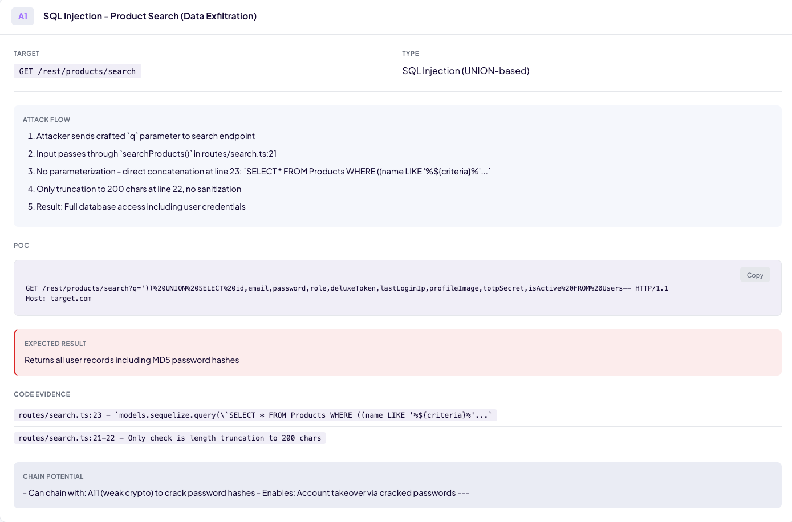

<h1 align="center">AI Offensive Code Review Pipeline</h1>

<p align="center">
Attack surface mapping for security testers. Point it at a codebase and get:
</p>

<p align="center">
<b>Service inventory</b> · <b>Attack surface map</b> · <b>Data flow analysis</b> · <b>Security conditions</b> · <b>Attack POCs</b>
</p>

<p align="center">
  
</p>

<p align="center">
  <a href="examples/juice-shop-report.html">View example report (Juice Shop)</a>
</p>

---

## Why This Exists

Traditional scanners flood you with severity labels and verdicts without evidence. This maps the attack surface, traces data flows, and surfaces conditions worth investigating. You get file paths, line numbers, and preconditions to validate yourself.

---

## Requirements

- [Claude Code CLI](https://github.com/anthropics/claude-code)
- Python 3.x (standard library only, no pip install needed)
- Target repository cloned locally

---

## Supported Projects

Works on any language Claude can read - JavaScript, TypeScript, Python, Go, Java, Rust, C#, Ruby, PHP, and more. No language-specific configuration needed.

**Best suited for:**
- Web applications with HTTP entry points
- Microservices and backend APIs
- Anything with identifiable attack surface (routes, handlers, data flows)

**Token usage:** This pipeline reads a lot of code. Large codebases = more tokens. A full run can take several minutes depending on codebase size. To reduce costs and time, run on specific subdirectories or use individual stages instead of the full pipeline.

---

## Quick Start

```bash
git clone https://github.com/izzy0101010101/ai-offensive-code-review.git
cd ai-offensive-code-review
claude
```

```
run /offensive-review /path/to/target/repo
```

That's it. Wait for the pipeline to complete and open `ai_artifacts/report.html`.

---

## Pipeline Flow

```
┌──────────────────────────────────────────────────────────────────────────────────────┐
│                              run /offensive-review                                    │
└──────────────────────────────────────────────────────────────────────────────────────┘
                                          │
                                          ▼
┌──────────┐   ┌──────────┐   ┌──────────┐   ┌──────────┐   ┌──────────┐   ┌──────────┐
│ Stage 0  │──▶│ Stage 1  │──▶│ Stage 2  │──▶│ Stage 3  │──▶│ Stage 4  │──▶│ Stage 5  │
│ Overview │   │ Services │   │  Entry   │   │  State & │   │ Findings │   │  Attack  │
│          │   │  & Deps  │   │  Points  │   │  Flows   │   │ (Leads)  │   │   POCs   │
└──────────┘   └──────────┘   └──────────┘   └──────────┘   └──────────┘   └──────────┘
                                                                                │
                                                                                ▼
                                                                      ┌─────────────────┐
                                                                      │  report.html    │
                                                                      └─────────────────┘
```

---

## Run Stages Individually

| Command | What it does |
|---------|--------------|
| `run /stage0` | Application overview and architecture diagram |
| `run /stage1` | Inventory services and dependencies |
| `run /stage2` | Extract entry points (HTTP, queues, SDK) |
| `run /stage3` | Map state mutations and cross-service calls |
| `run /stage4` | Identify conditions requiring validation |
| `run /stage5` | Generate attack paths with code-specific POCs |
| `run /generate-report` | Generate HTML report from all artifacts |

---

## Output Structure

```
ai_artifacts/
├── stage0/
│   └── overview.md         # Application overview & architecture
├── stage1/
│   ├── services.csv        # Service inventory with path aliases
│   └── dependencies.csv    # External dependencies
├── stage2/
│   └── entry_points.csv    # All entry surfaces
├── stage3/
│   └── state_and_links.csv # State operations & cross-service links
├── stage4/
│   └── findings.csv        # Conditions for human validation
├── stage5/
│   └── attack_paths.md     # Verified attack chains with POCs
└── report.html             # Interactive HTML report
```

---

## Project Structure

```
.claude/skills/       # Pipeline commands (stage0-5, offensive-review, generate-report)
scripts/
├── generate_report.py   # Builds HTML report from all artifacts
├── validate-csv.sh      # Validates CSV structure
└── init-review.sh       # Creates ai_artifacts directories
ai_artifacts/         # Output directory (gitignored)
```

---

## Report Sections

| Section | What It Shows |
|---------|---------------|
| **Overview** | Application summary and architecture diagram |
| **Services** | Identified services/modules with entry files and build commands |
| **Entry Points** | HTTP routes, queues, WebSockets, SDK methods - your attack surface |
| **Data Flows** | State mutations, DB writes, cross-service calls - where data goes |
| **Leads** | Conditions worth investigating with preconditions and code locations |
| **Attack Paths** | Traced attack chains with working POCs based on actual code |
| **Dependencies** | External libraries and versions per service |

---

## Example Lead


## Example Attack Path



---

## Permissions

This repo includes pre-configured permissions in `.claude/settings.local.json` so the pipeline runs without constant approval prompts.

Included permissions:
- All pipeline skills (stage0-5, offensive-review, generate-report)
- `python3` for report generation
- `git clone` for cloning target repos

To customize, edit `.claude/settings.local.json` or see the [Claude Code documentation](https://github.com/anthropics/claude-code).

---

## Philosophy

- **Mapper, not scanner** - Shows you where to look, doesn't claim exploitability
- **Leads, not verdicts** - AI identifies conditions, humans validate
- **No security theater** - No "CRITICAL" labels or impact scores
- **Evidence-based** - Every finding links to specific code locations
- **Transparent** - CSV outputs are auditable, not black-box

This is a reconnaissance tool. You still do the actual security testing.

---

## Disclaimer

For authorized security testing and educational purposes only. Do not use on systems without permission. The authors are not responsible for misuse.
