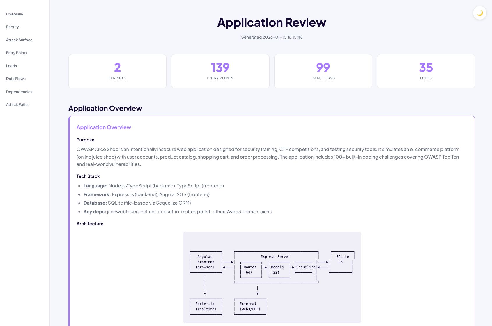
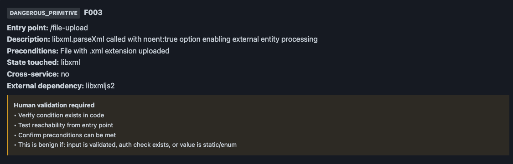

<h1 align="center">AI Offensive Code Review Pipeline</h1>

<p align="center">
Automated security code review powered by Claude. Point it at a codebase and get:
</p>

<p align="center">
<b>Service inventory</b> · <b>Attack surface map</b> · <b>Data flow analysis</b> · <b>Security conditions</b>
</p>

<p align="center">
  
</p>

---

## Why This Exists

I still believe in manual security testing - but AI can help map what's there so nothing gets missed. Traditional scanners flood you with false positives, severity labels that mean nothing, and "CRITICAL" alerts that waste hours of manual triage. They give you verdicts without evidence, confidence without context, and noise without signal. This pipeline takes a different approach: it maps your entire attack surface, traces data flows, and identifies security-relevant conditions - then hands you evidence to validate yourself. No severity theater, no black-box verdicts, just hypotheses backed by file paths, line numbers, and preconditions. You spend time testing real issues instead of dismissing false ones.

---

## Requirements

- [Claude Code CLI](https://github.com/anthropics/claude-code)
- Python 3.x (standard library only, no pip install needed)
- Target repository cloned locally

---

## Supported Projects

Works on any codebase Claude can read:

| Language | Status |
|----------|--------|
| JavaScript/TypeScript | Tested |
| Python | Tested |
| Go | Tested |
| Java | Tested |
| C#, Ruby, PHP | Supported |
| Rust, C/C++, Kotlin, Swift | Supported |

**Best suited for:**
- Web applications (REST APIs, GraphQL, web servers)
- Microservices architectures
- Backend services with HTTP/queue entry points

**Token usage:** This pipeline reads a lot of code. Expect significant token usage on large codebases. For cost control, run on specific subdirectories or use individual stages instead of the full pipeline.

---

## Quick Start

```bash
git clone https://github.com/izzy0101010101/ai-offensive-code-review.git
cd ai-offensive-code-review
claude
```

```
run /offensive-review /path/to/target/repo
```

That's it. Wait for the pipeline to complete and open `ai_artifacts/report.html`.

---

## Pipeline Flow

```
┌─────────────────────────────────────────────────────────────────┐
│                    run /offensive-review                        │
└─────────────────────────────────────────────────────────────────┘
                              │
                              ▼
┌─────────────┐    ┌─────────────┐    ┌─────────────┐    ┌─────────────┐
│   Stage 1   │───▶│   Stage 2   │───▶│   Stage 3   │───▶│   Stage 4   │
│  Services   │    │   Entry     │    │   State &   │    │  Findings   │
│    & Deps   │    │   Points    │    │   Flows     │    │(Hypotheses) │
└─────────────┘    └─────────────┘    └─────────────┘    └─────────────┘
                              │
                              ▼
                    ┌─────────────────┐
                    │  report.html    │
                    └─────────────────┘
```

---

## Run Stages Individually

| Command | What it does |
|---------|--------------|
| `run /stage1` | Inventory services and dependencies |
| `run /stage2` | Extract entry points (HTTP, queues, SDK) |
| `run /stage3` | Map state mutations and cross-service calls |
| `run /stage4` | Identify conditions requiring validation |
| `run /generate-report` | Generate HTML report from CSVs |

---

## Output Structure

```
ai_artifacts/
├── stage1/
│   ├── services.csv        # Service inventory with path aliases
│   └── dependencies.csv    # External dependencies
├── stage2/
│   └── entry_points.csv    # All entry surfaces
├── stage3/
│   └── state_and_links.csv # State operations & cross-service links
├── stage4/
│   └── findings.csv        # Conditions for human validation
└── report.html             # Interactive HTML report
```

---

## Project Structure

```
.claude/skills/       # Pipeline commands (stage1-4, offensive-review, generate-report)
scripts/
├── generate_report.py   # Builds HTML report from CSVs
├── validate-csv.sh      # Validates CSV structure
└── init-review.sh       # Creates ai_artifacts directories
ai_artifacts/         # Output directory (gitignored)
```

---

## Condition Types

Findings use these condition types (not severity labels):

| Type | Description |
|------|-------------|
| `MISSING_VALIDATION` | Input used without validation |
| `TRUST_BOUNDARY_CROSSING` | Data crosses trust boundaries |
| `DANGEROUS_PRIMITIVE` | Use of inherently risky functions |
| `STATE_MUTATION` | State change worth examining |
| `CONFIG_DEPENDENT` | Behavior depends on configuration |
| `EXTERNAL_CALL_INPUT` | User input in external calls |
| `FILE_INTERACTION` | File system operations |
| `SUBPROCESS_EXEC` | Process/command execution |

---

## Example Finding




---

## Permissions

This repo includes pre-configured permissions in `.claude/settings.local.json` so the pipeline runs without constant approval prompts.

Included permissions:
- All pipeline skills (stage1-4, offensive-review, generate-report)
- `python3` for report generation
- `git clone` for cloning target repos

To customize, edit `.claude/settings.local.json` or see the [Claude Code documentation](https://docs.anthropic.com/en/docs/claude-code).

---

## Philosophy

- **Hypotheses, not verdicts** - AI identifies conditions, humans validate
- **No security theater** - No "CRITICAL" labels or impact scores
- **Evidence-based** - Every finding links to specific code locations
- **Transparent** - CSV outputs are auditable, not black-box

---

## License

MIT
